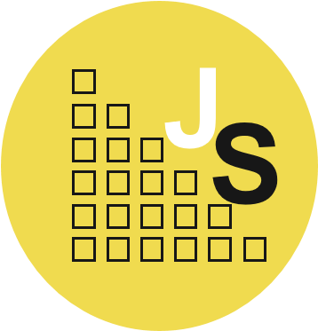
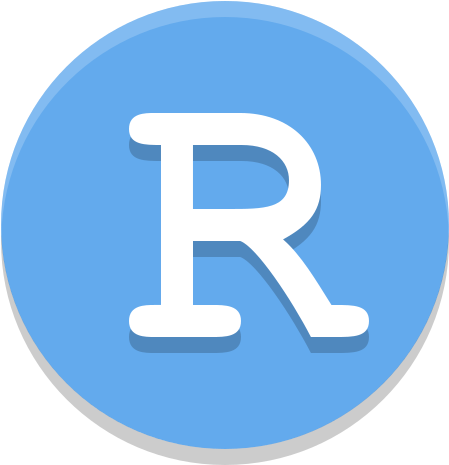

<h2> 𝐇𝐞𝐥𝐥𝐨, I’m Yashmika Anusara </h2>

### What I'm currently learning:

&nbsp;&nbsp;&nbsp;&nbsp;
&nbsp;&nbsp;&nbsp;&nbsp;&nbsp;
&nbsp;&nbsp;&nbsp;&nbsp;
&nbsp;&nbsp;&nbsp;&nbsp;
&nbsp;&nbsp;&nbsp;&nbsp;

### 👋 Hi, I’m Yashmika Anusara
### 👀 I’m interested in Computer Programming
### 🌱 I’m currently learning Mern Stack
<!--
**YashmikaAnusara/YashmikaAnusara** is a ✨ _special_ ✨ repository because its `README.md` (this file) appears on your GitHub profile.

Here are some ideas to get you started:

- 🔭 I’m currently working on ...
- 🌱 I’m currently learning ...
- 👯 I’m looking to collaborate on ...
- 🤔 I’m looking for help with ...
- 💬 Ask me about ...
- 📫 How to reach me: ...
- 😄 Pronouns: ...
- ⚡ Fun fact: ...
-->
